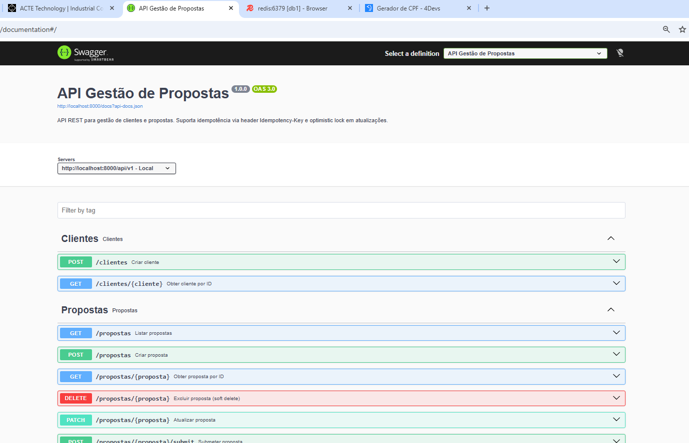
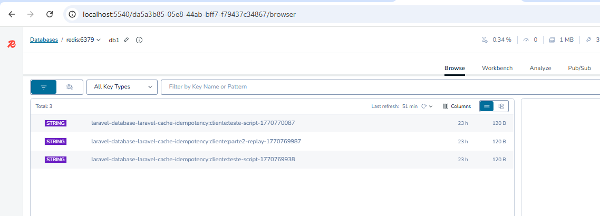
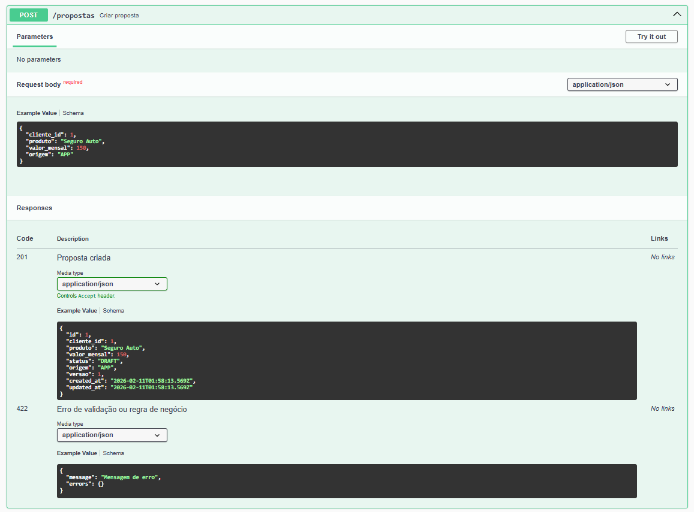
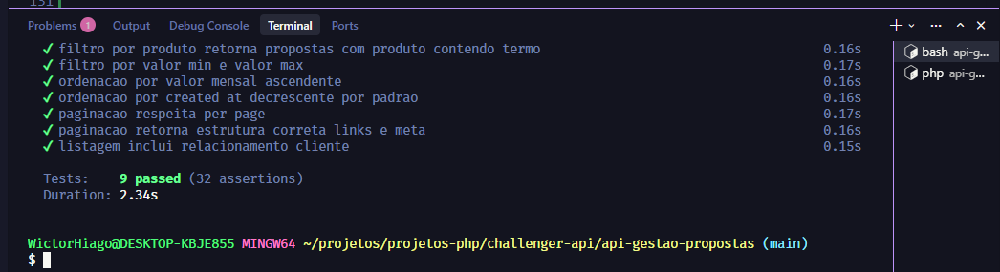

# API Gestão de Propostas

API REST para gestão de clientes e propostas, construída com Laravel 12.


## Preview

| Documentação Swagger | Redis (Idempotency) |
|:---:|:---:|
|  |  |

| API em ação | Testes |
|:---:|:---:|
|  |  |

## Requisitos

- PHP 8.3+
- Composer
- PostgreSQL 16
- Redis 7

## QUICK START

1. No diretorio raiz de 'api-gestao-propostas' contem o arquivo 'docker-compose.yaml'
```bash
cd api-gestao-propostas
# renomear .env.example para .env
docker compose up -d
```

2. Instale dependências e rode migrations:
```bash
composer install
php artisan migrate
php artisan db:seed
```
3. Inicie o servidor:
```bash
php artisan serve
```

- **API:** `http://localhost:8000`
- **Swagger:** `http://localhost:8000/api/documentation`
- **Redis UI:** `http://localhost:5540` | Conexão: `redis://default@redis:6379` (alternar db0 para db1)

## Migrations

```bash
# Executar migrations
php artisan migrate

# Rollback (reverter última migration)
php artisan migrate:rollback

# Status das migrations
php artisan migrate:status
```

## Seeders

Popular o banco com dados de teste:

```bash
php artisan db:seed
```

## Endpoints

| Método | Rota | Descrição |
|--------|------|-----------|
| POST | /api/v1/clientes | Criar cliente (Idempotency-Key opcional) |
| GET | /api/v1/clientes/{id} | Obter cliente |
| POST | /api/v1/propostas | Criar proposta |
| GET | /api/v1/propostas | Listar propostas (filtros, paginação) |
| GET | /api/v1/propostas/{id} | Obter proposta |
| PATCH | /api/v1/propostas/{id} | Atualizar proposta (versão obrigatória) |
| POST | /api/v1/propostas/{id}/submit | Submeter proposta |
| POST | /api/v1/propostas/{id}/approve | Aprovar proposta |
| POST | /api/v1/propostas/{id}/reject | Rejeitar proposta |
| POST | /api/v1/propostas/{id}/cancel | Cancelar proposta |
| DELETE | /api/v1/propostas/{id} | Excluir proposta (soft delete) |
| GET | /api/v1/propostas/{id}/auditoria | Histórico de auditoria |

### Filtros da listagem de propostas

- `status` — DRAFT, SUBMITTED, APPROVED, REJECTED, CANCELED
- `cliente_id` — ID do cliente
- `produto` — Busca parcial (ILIKE)
- `valor_min` — Valor mensal mínimo
- `valor_max` — Valor mensal máximo
- `ordenar_por` — created_at, valor_mensal, produto, etc.
- `direcao` — asc ou desc
- `per_page` — Itens por página (máx. 100, default 15)

## Documentação Swagger

A API conta com documentação interativa via Swagger (OpenAPI 3.0). Com o servidor rodando, acesse:

```
http://localhost:8000/api/documentation
```

## Padrão de erros

Respostas de erro seguem o formato:

```json
{
  "message": "Mensagem descritiva",
  "errors": {}
}
```

Códigos HTTP: 400 (validação), 404 (não encontrado), 409 (conflito de versão), 422 (regra de negócio).

## Testes Automatizados

### Grupos de teste

| Grupo | Descrição |
|-------|-----------|
| `transicao-status` | Transições válidas e inválidas de status (DRAFT→SUBMITTED→APPROVED/REJECTED/CANCELED) |
| `idempotencia` | Idempotency-Key em clientes e submit de propostas — mesma chave retorna o mesmo recurso |
| `conflito-versao` | Optimistic lock — PATCH com versão desatualizada retorna 409 |
| `busca-filtros` | Filtros (status, cliente_id, produto, valor_min/max), ordenação e paginação |

### Comandos

```bash
# Por categoria
php artisan test --group=transicao-status
php artisan test --group=idempotencia
php artisan test --group=conflito-versao
php artisan test --group=busca-filtros

# Todos os testes do desafio
php artisan test --group=transicao-status --group=idempotencia --group=conflito-versao --group=busca-filtros

# Todos os testes
php artisan test
```

### Cobertura

- **CriarClienteActionTest** — Idempotência (retorna existente, cria e armazena chave), normalização de documento
- **SubmeterPropostaActionTest** — Transições de status, idempotência no submit
- **AtualizarPropostaActionTest** — Conflito de versão (409), edição apenas em DRAFT
- **PropostaRepositoryTest** — Filtros (status, cliente_id, produto, valor_min/max), ordenação, paginação, eager loading de cliente

